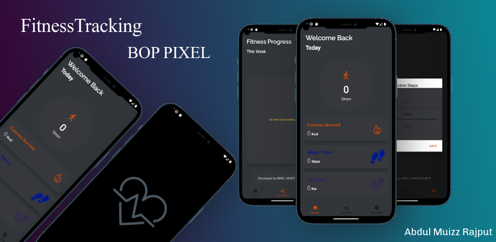

# Fitness Tracker Application

**Developed by:** Abdul Muizz Rajput  
**Design Idea by:** AtilMohAmine
**Coding by:** Abdul Muizz Rajput

## Overview

Welcome to the Fitness Tracker Application! This open-source project allows users to track their daily fitness activities, including steps taken, distance traveled, and calories burned. The app also lets users set daily fitness goals and visualize their progress with interactive graphs and charts. Built using MVVM architecture, this project ensures a clean separation of concerns and efficient management of app data.

## Features

- **Track Fitness Activities:** Monitor steps taken, distance traveled, and calories burned.
- **Set Fitness Goals:** Establish daily fitness goals and track progress.
- **Data Visualization:** View fitness data through interactive graphs and charts.
- **MVVM Architecture:** Utilizes MVVM architecture for a well-structured codebase.

## Technologies

- **Kotlin:** For Android development.
- **Android:** Platform for building the app.
- **Google Fit API:** To access fitness data.
- **MVVM Architecture:** For a clean and maintainable codebase.
- **MPAndroidChart:** For graphing and charting fitness data.

## Getting Started

To get started with the Fitness Tracker Application, follow these steps:

1. **Clone the Repository**

    ```bash
    git clone https://github.com/abdulmuizzrajput/FitnessTracker.git
    ```

2. **Setup**

    - Open the project in [Android Studio](https://developer.android.com/studio).
    - Ensure all required SDKs and libraries are installed.
    - Configure the Google Fit API credentials as necessary.

3. **IDE Requirements**

    - **IDE:** Android Studio
    - **Target API:** 34
    - **Minimum API:** 24
    - **Updated On:** 09/08/2024

## Contributing

We welcome contributions to enhance this project! To contribute:

- Fork the repository.
- Create a new branch for your feature or fix.
- Submit a pull request with a clear description of your changes.

For any suggestions or issues, please use the GitHub [issue tracker](https://github.com/abdulmuizzrajput/FitnessTracker/issues).

## License

This project is licensed under the MIT License. See the [LICENSE](LICENSE) file for details.

## Contact

For freelance opportunities or questions, contact us at:

- **Email:** [info@boppixel.in](mailto:info@boppixel.in) or [muizz7041@gmail.com](mailto:muizz7041@gmail.com)
- **LinkedIn:** [Abdul Muizz Rajput](https://pk.linkedin.com/in/abdulmuizzrajput)

## Acknowledgements

- **Third-Party Images:** [Lottie Json Files, Copyright-Free Graphics]

## Website

For more information about this project, visit our [website](https://github.com/abdulmuizzrajput/website).
